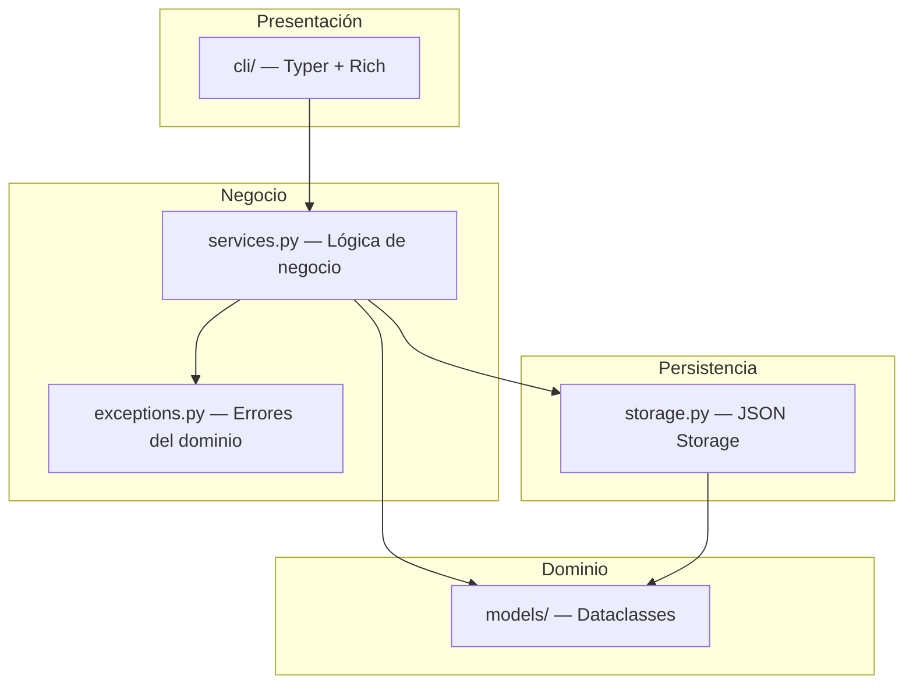
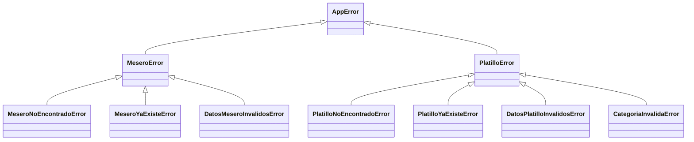

# 🏗️ Arquitectura

Esta sección describe las decisiones de diseño tomadas en el proyecto y los principios de código limpio aplicados.

---

## Estructura del proyecto (src layout)

El proyecto utiliza el patrón **src layout**, que separa el código fuente de la configuración y los tests:

```
restaurante-cli/
├── main.py                  # Punto de entrada
├── pyproject.toml           # Configuración del proyecto
├── data/                    # Archivos JSON de persistencia
│   ├── meseros.json
│   └── platillos.json
├── src/
│   └── mi_app/
│       ├── cli/             # Capa de presentación (Typer + Rich)
│       │   ├── app.py
│       │   ├── meseros.py
│       │   └── platillos.py
│       ├── models/          # Entidades del dominio (dataclasses)
│       │   ├── mesero.py
│       │   └── platillo.py
│       ├── services.py      # Lógica de negocio
│       ├── storage.py       # Capa de persistencia
│       └── exceptions.py    # Excepciones personalizadas
├── tests/
│   └── test_services.py
└── docs/                    # Documentación MkDocs
```

!!! info "¿Por qué src layout?"
    Este patrón evita que el código fuente se importe accidentalmente desde la raíz del proyecto, obligando a usar instalaciones explícitas. Es una práctica recomendada por la comunidad Python.

---

## Separación por capas

El sistema está organizado en **4 capas** con responsabilidades bien definidas:



### Capa CLI (`cli/`)

Maneja toda la interacción con el usuario: prompts, tablas Rich, paneles de éxito/error. **No contiene lógica de negocio**; delega todo al servicio correspondiente.

### Capa de Servicios (`services.py`)

Contiene las reglas de negocio: verificar duplicados, buscar por ID, validar credenciales. Recibe un objeto `Storage` por inyección en el constructor.

### Capa de Modelos (`models/`)

Define las entidades `Mesero` y `Platillo` como `dataclasses` con validaciones en `__post_init__`. Cada entidad vive en su propio archivo.

### Capa de Storage (`storage.py`)

Implementa la lectura/escritura de JSON. Usa `Protocol` para definir contratos, lo que facilita la extensibilidad.

---

## Principios de código limpio aplicados

### Single Responsibility Principle (SRP)

Cada módulo tiene una única responsabilidad:

- `models/` → solo define la estructura y validación de datos.
- `services.py` → solo contiene lógica de negocio.
- `storage.py` → solo maneja persistencia.
- `cli/` → solo maneja la interfaz de usuario.

### Dependency Inversion

Los servicios dependen de abstracciones (`Protocol`), no de implementaciones concretas. Esto permite usar mocks en los tests sin necesidad de archivos JSON reales.

### Don't Repeat Yourself (DRY)

Los helpers de UI (`_ok`, `_error`, `_tabla_meseros`, `_tabla_platillos`) encapsulan patrones repetidos de presentación, evitando duplicar código de Rich en cada comando.

### Fail Fast

Los modelos validan sus datos inmediatamente al crearse gracias a `__post_init__`. Si un dato es inválido, se lanza una excepción antes de que el objeto entre en el sistema.

!!! example "Ejemplo de validación temprana"
    ```python
    @dataclass
    class Mesero:
        mesero_id: int
        nombre: str
        pin: str

        def __post_init__(self) -> None:
            self._validar_id()
            self._validar_nombre()
            self._validar_pin()
    ```

---

## Jerarquía de excepciones

Las excepciones siguen una jerarquía que facilita el manejo de errores:



!!! tip "¿Por qué una jerarquía?"
    Permite capturar errores de forma granular (`MeseroNoEncontradoError`) o general (`AppError`) según el contexto.
