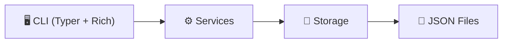

# 🍽️ Restaurante CLI

**Sistema de gestión para restaurante** — una aplicación de línea de comandos construida con Python, Typer y Rich.

---

## ¿Qué es Restaurante CLI?

Restaurante CLI es una herramienta de terminal que permite gestionar las operaciones básicas de un restaurante: administrar meseros y el menú de platillos. Está diseñada como proyecto académico aplicando principios de código limpio y arquitectura por capas.

## Características principales

- **Gestión de meseros**: registro, login con PIN, listado y eliminación.
- **CRUD de platillos**: crear, listar, filtrar por categoría, actualizar y eliminar platillos del menú.
- **Menú interactivo**: interfaz visual en terminal con tablas, paneles y colores usando Rich.
- **Comandos directos**: también se puede usar con flags (`--id`, `--nombre`, etc.) sin pasar por el menú.
- **Validaciones robustas**: cada modelo valida sus datos al momento de crearse usando `__post_init__`.
- **Persistencia en JSON**: los datos se almacenan en archivos `.json` en la carpeta `data/`.

## Arquitectura general

El proyecto sigue una arquitectura en capas con separación clara de responsabilidades:

| Capa | Responsabilidad |
|------|----------------|
| **CLI** | Interacción con el usuario (prompts, tablas, paneles) |
| **Services** | Lógica de negocio y validaciones de flujo |
| **Storage** | Lectura/escritura de datos desde archivos JSON |
| **Models** | Definición de entidades con `dataclasses` y validaciones |

!!! tip "¿Primera vez aquí?"
    Dirígete a la sección de [Primeros pasos](getting-started.md) para instalar y ejecutar el proyecto.
