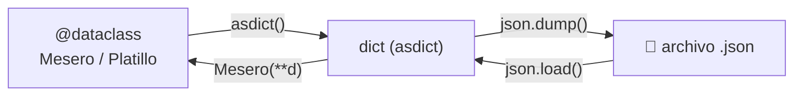
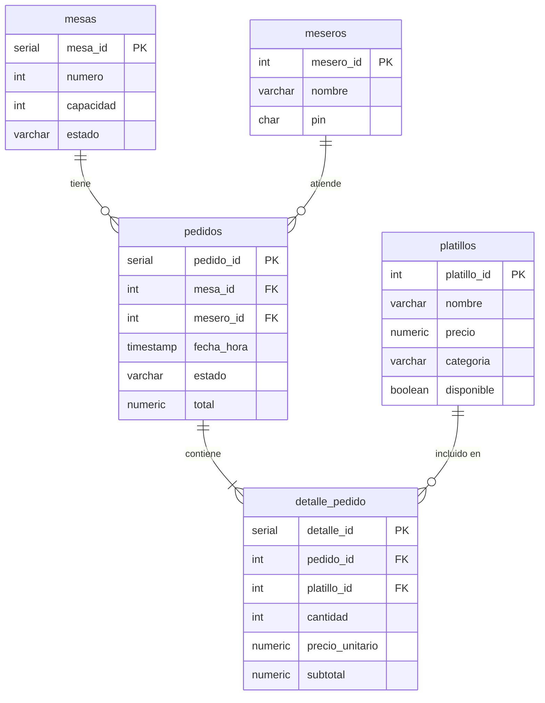
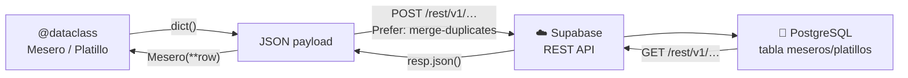

# 💾 Persistencia de datos

El sistema soporta **dos mecanismos de persistencia intercambiables**: archivos JSON locales y una base de datos PostgreSQL alojada en **Supabase**. El modo activo se determina automáticamente al iniciar la aplicación según las variables de entorno configuradas.

---

## Selección automática del backend

Al arrancar, los módulos CLI comprueban si las variables `SUPABASE_URL` y `SUPABASE_KEY` están definidas en el entorno (cargadas desde el archivo `.env`):

```python
def _build_storage():
    if os.environ.get("SUPABASE_URL") and os.environ.get("SUPABASE_KEY"):
        return MeseroSupabaseStorage()          # ☁️  Supabase
    return MeseroJSONStorage(Path("data/meseros.json"))  # 📄 JSON local
```

| Condición | Backend activo | Archivo usado |
|-----------|---------------|---------------|
| Sin `.env` | JSON local | `data/meseros.json`, `data/platillos.json` |
| Con `.env` y claves válidas | Supabase REST API | Tablas `meseros`, `platillos` en PostgreSQL |

---

## Modo JSON (local)

### Ubicación de los archivos

Los datos se almacenan en la carpeta `data/` en la raíz del proyecto:

```
data/
├── meseros.json
└── platillos.json
```

!!! info "Creación automática"
    Si los archivos no existen al iniciar la aplicación, el sistema los crea automáticamente al realizar la primera operación de escritura.

### Estructura de los datos

#### meseros.json

```json
[
  { "mesero_id": 1, "nombre": "Carlos Pérez", "pin": "1234" },
  { "mesero_id": 2, "nombre": "María López",  "pin": "5678" }
]
```

#### platillos.json

```json
[
  {
    "platillo_id": 1,
    "nombre": "Sopa del día",
    "precio": 12000.0,
    "categoria": "entrada",
    "disponible": true
  }
]
```

### Cómo funciona la serialización

Los modelos están implementados con `dataclasses`, lo que permite convertirlos fácilmente a diccionarios usando `dataclasses.asdict()`.



---

## Modo Supabase (PostgreSQL en la nube)

### Configuración del entorno

1. Crea el archivo `.env` en la raíz del proyecto (ya está incluido en `.gitignore`):

    ```bash
    # .env
    SUPABASE_URL=https://[TU_REF].supabase.co
    SUPABASE_KEY=[TU_ANON_KEY_O_SERVICE_ROLE_KEY]
    ```

2. Las claves se obtienen en **Supabase → Settings → API**.

!!! warning "Permisos de escritura"
    Si usas la **anon key**, asegúrate de que las políticas RLS (Row Level Security) de Supabase permitan operaciones `INSERT`, `UPDATE` y `DELETE` en las tablas `meseros` y `platillos`.  
    La **service_role key** tiene acceso completo sin necesidad de configurar RLS.

### Crear las tablas en Supabase

Ejecuta el archivo `schema.sql` (incluido en la raíz del proyecto) desde el **SQL Editor** de Supabase.  
Este script crea las siguientes tablas con todas sus restricciones:

| Tabla | Descripción | Clave primaria |
|-------|-------------|----------------|
| `meseros` | Empleados del restaurante | `mesero_id` (asignado por el operador) |
| `platillos` | Ítems del menú | `platillo_id` (asignado por el operador) |
| `mesas` | Mesas físicas del restaurante | `mesa_id` (SERIAL) |
| `pedidos` | Órdenes de los clientes | `pedido_id` (SERIAL) |
| `detalle_pedido` | Líneas de cada pedido | `detalle_id` (SERIAL) |

### Modelo Entidad-Relación (ER)



### Cómo funciona el almacenamiento en Supabase

La comunicación se realiza mediante la **API REST de Supabase** (PostgREST), con operaciones UPSERT y DELETE selectivo para mantener la tabla sincronizada con el estado en memoria.



#### Guardar (sincronización)

1. **UPSERT** de todos los registros actuales (`POST` con `Prefer: resolution=merge-duplicates`).
2. **DELETE** de los registros cuyo ID ya no esté en la lista (mantiene integridad referencial).

#### Cargar (lectura)

1. `GET` a la tabla correspondiente con orden por ID ascendente.
2. Reconstrucción de los objetos usando `Mesero(**row)` / `Platillo(**row)`.
3. Al reconstruir, `__post_init__` valida automáticamente los datos recibidos.

!!! tip "Contrato de Storage (Protocol)"
    Ambas implementaciones (JSON y Supabase) respetan el mismo `Protocol`, lo que permite añadir futuros backends (SQLite, Redis, etc.) sin cambiar nada en los servicios.

    ```python
    class MeseroStorage(Protocol):
        def cargar(self) -> list[Mesero]: ...
        def guardar(self, meseros: list[Mesero]) -> None: ...
    ```
