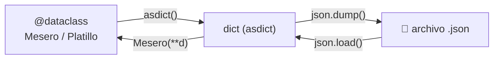

# 💾 Persistencia de datos

El sistema utiliza archivos **JSON** como mecanismo de persistencia. Esto permite almacenar los datos de forma simple y legible sin necesidad de una base de datos externa.

---

## Ubicación de los archivos

Los datos se almacenan en la carpeta `data/` en la raíz del proyecto:

```
data/
├── meseros.json
└── platillos.json
```

!!! info "Creación automática"
    Si los archivos no existen al iniciar la aplicación, el sistema los crea automáticamente al realizar la primera operación de escritura.

---

## Estructura de los datos

### meseros.json

Cada mesero se serializa como un objeto JSON con los siguientes campos:

```json
[
  {
    "mesero_id": 1,
    "nombre": "Carlos Pérez",
    "pin": "1234"
  },
  {
    "mesero_id": 2,
    "nombre": "María López",
    "pin": "5678"
  }
]
```

### platillos.json

Cada platillo incluye un campo adicional `disponible`:

```json
[
  {
    "platillo_id": 1,
    "nombre": "Sopa del día",
    "precio": 12000.0,
    "categoria": "entrada",
    "disponible": true
  }
]
```

---

## Cómo funciona la serialización

Los modelos están implementados con `dataclasses`, lo que permite convertirlos fácilmente a diccionarios usando `dataclasses.asdict()`.



### Guardar (serialización)

1. Se convierte cada `dataclass` a `dict` con `asdict()`.
2. Se escribe la lista de diccionarios al archivo con `json.dump()`.

### Cargar (deserialización)

1. Se lee el archivo JSON con `json.load()`.
2. Se reconstruye cada objeto usando `Mesero(**item)` o `Platillo(**item)`.
3. Al reconstruir, `__post_init__` valida automáticamente los datos.

!!! warning "Validación al cargar"
    Si un archivo JSON contiene datos inválidos (por ejemplo, un PIN con letras), la aplicación lanzará un error al intentar cargarlo, ya que los modelos validan en `__post_init__`.

---

## Contrato de Storage (Protocol)

La capa de storage está definida mediante `Protocol`, lo que permite cambiar la implementación (por ejemplo, a SQLite o a una API) sin modificar la lógica de negocio.

```python
class MeseroStorage(Protocol):
    def cargar(self) -> list[Mesero]: ...
    def guardar(self, meseros: list[Mesero]) -> None: ...
```

!!! tip "Extensibilidad"
    Gracias al uso de `Protocol`, se podría crear un `MeseroSQLiteStorage` que implemente los mismos métodos y usarlo sin cambiar nada en los servicios.
